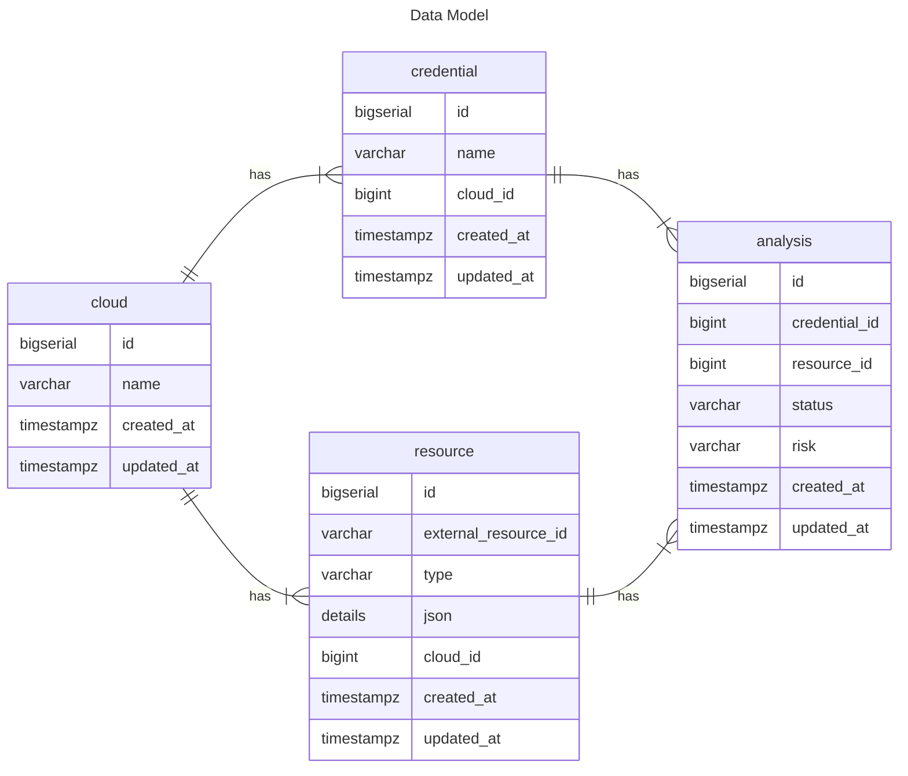

# cloud-security-platform

## Setup

```
```

## Design

<a href="./ARCHITECTURE.md"> ARCHITECTURE.md </a>

## Data Model

```mermaid
---
title: Data Model
---
erDiagram
    direction LR
    credential ||--|{ analysis : has
    credential {
        bigserial id
        varchar name
        bigint cloud_id
        timestampz created_at
        timestampz updated_at
    }
    analysis {
        bigserial id
        bigint credential_id
        bigint resource_id
        varchar status
        varchar risk
        timestampz created_at
        timestampz updated_at
    }
    resource ||--|{ analysis : has
    resource {
        bigserial id
        varchar external_resource_id
        varchar type
        details json
        bigint cloud_id
        timestampz created_at
        timestampz updated_at
    }
    cloud ||--|{ credential : has
    cloud ||--|{ resource : has
    cloud {
        bigserial id
        varchar name
        timestampz created_at
        timestampz updated_at
    }
```
