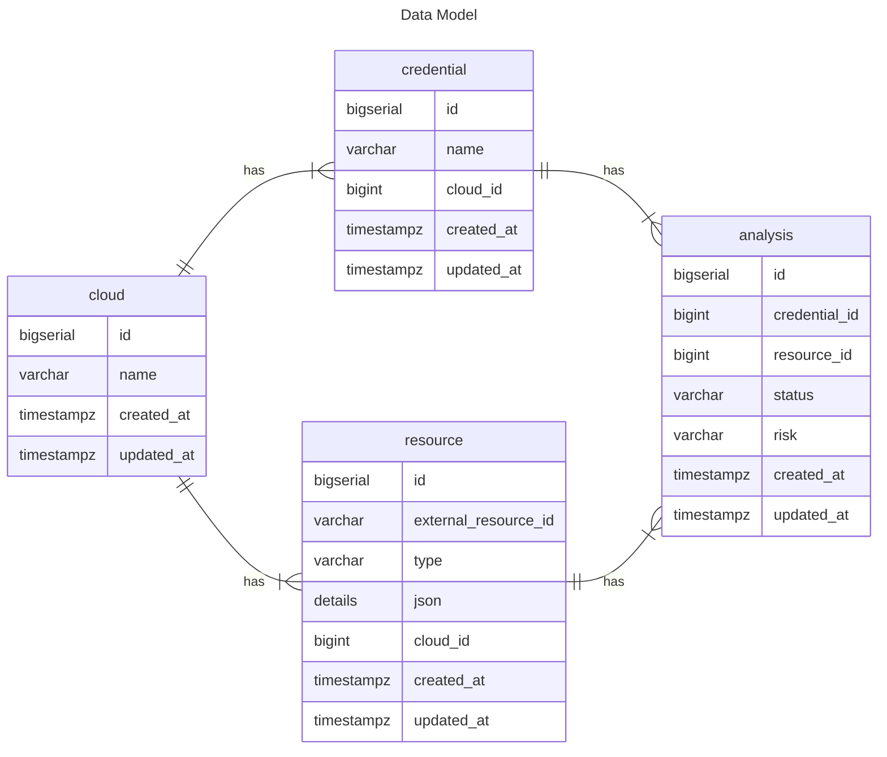

# cloud-security-platform

## Setup

```
ROOT_FOLDER=`pwd`
CSPM_POSTGRES_PASSWORD=[MY_PASSWORD]

cd ${ROOT_FOLDER}/postgres
docker build --build-arg CSPM_POSTGRES_PASSWORD=${CSPM_POSTGRES_PASSWORD} -t cspm-postgres .
docker run -it -d cspm-postgres --name cspm-postgres
docker exec -it cspm-postgres "psql -U cspm -W -d cspm -a -f ${ROOT_FOLDER}/cspm-api/src/db/migrations/2026-01-03"

echo "sed command may work. Please try editing cspm-api/.env file without sed" && cd ${ROOT_FOLDER}/cspm-api && sed -e "/s/POSTGRES_PASSWORD=\"\"/POSTGRES_PASSWORD=\"${CSPM_POSTGRES_PASSWORD}\"/g" -i .env

echo "POSTGRES_HOST is set as localhost in cspm-api/.env. Please update to docker postgres container uri. >> docker exec -it [postgres docker container] /bin/sh >> cat /etc/hosts [You will find line with ip of postgres docker like 172.17.0.1	06d93546a9a1]" && cd ${ROOT_FOLDER}/cspm-api && sed -e "/s/POSTGRES_HOST=\"localhost\"/POSTGRES_HOST=\"172.17.0.1\"/g" -i .env

cd ${ROOT_FOLDER}/cspm-api
docker build -t cspm-api .
docker run -it -d -p 8000:8000 cspm-api

cd ${ROOT_FOLDER}/cspm-ui
docker build -t cspm-ui .
docker run -it -d -p 3000:3000 cspm-ui
```

## Design

<a href="./ARCHITECTURE.md"> ARCHITECTURE.md </a>

## Data Model

